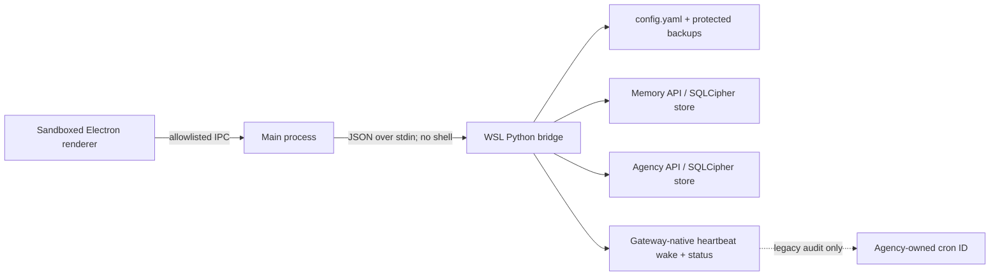

# Hermes Control Center

A local Windows/Electron audit and control surface for the Hermes suite:

- [Hermes Consolidating Local Memory](https://github.com/b7216309-jpg/hermes-consolidating-local-memory)
- [Hermes Conscious Agency](https://github.com/b7216309-jpg/hermes-conscious-agency)

Version 3.1 supports Memory 3.5 and Conscious Agency 1.1's gateway-native heartbeat. It audits
disposable-session cleanup, Memory isolation, claimed-wake recovery, process ownership, and
at-most-once delivery in addition to status, wake, enable, disable, migration, and preservation of
every unrelated Hermes cron job.


## What it controls

| Area | Read and audit | Mutations |
|---|---|---|
| Memory | Facts, topics, sessions, traces, journals, summaries, preferences, policies, working memory, procedures, prospective and autobiographical memory, links, evidence, contradictions, approvals, queues, graph, doctor report | Allowlisted schema edits, soft deactivation, approvals, retries, maintenance, backup, export, restore |
| Agency | Workspace, self-model, intentions, questions, reflections, decisions, events, subjective journal, proactive gates, heartbeat state and native-integration audit | Focus, intentions, questions, observations, pause/resume, heartbeat wake/enable/disable, exact legacy-cron removal, backup, restore |
| Suite | Installed versions, active configuration, databases, gateway state, encrypted storage, backups and audit-chain integrity | Validated configuration profiles and gateway activation |

The renderer never receives a shell, SQL console, arbitrary path reader, environment variables, or
raw process access. Every write is selected from a fixed operation list in the WSL bridge.

## Views


- **Dashboard:** plugin versions, health, counts, pending work, gateway state, database selection.
- **Memory:** search, inspect, edit supported fields, and preserve history before each mutation.
- **Agency:** inspect state and gates; control the native heartbeat without touching general cron.
- **Config:** edit typed plugin settings generated from the installed plugin schemas.
- **Graph:** explore bounded memory nodes and relationships.
- **Backups:** inventory and restore verified controller-owned database backups.
- **Audit:** verify the append-only hash chain of operator actions.
- **Wiki:** render the memory plugin's local Markdown export through DOMPurify.
- **Educational Lab:** timed access to explicit high-risk research profiles.


## Native heartbeat controls

Conscious Agency 1.1 no longer owns a Hermes cron job. Control Center exposes:

- current enablement, interval, target, active hours, next due time, last status/reason, and run
  count;
- **Wake now**, which writes one coalesced manual request for the gateway scheduler;
- **Enable** and **Disable**, which atomically update config and restart Hermes only if it was
  already running;
- **Remove legacy cron**, which first backs up Agency state, then asks the plugin to remove only the
  cron ID recorded in its own database and migrate retired config keys;
- a source/runtime audit for target-session routing, disposable-session cleanup, stale-session
  reconciliation, Memory isolation, a non-delivery model-work route, absence of Hermes' reserved
  async-delegation session pin, claimed-wake recovery, the runner process lease, delivery outcomes,
  structured response, guardrail state, and cron independence.



The bridge still reads `~/.hermes/cron/jobs.json` narrowly when a legacy Agency job ID exists. This
is audit and migration code, not a general cron editor. No operation enumerates or alters unrelated
jobs.

## Safety model

Every mutation follows a preview/confirm/execute flow:

1. The main process builds a short-lived plan from a fixed action contract.
2. The UI shows scope, risk, and the exact confirmation phrase.
3. Electron and the bridge reject undeclared payload fields, then validate every ID, type, range,
   path, URL, time value, and plugin setting.
4. Database/config mutations create a verified protected backup first where applicable.
5. Config writes use a temporary file plus atomic replacement.
6. A running gateway is restarted only when activation requires it; a stopped gateway stays
   stopped.
7. Activation failure restores the previous config and original gateway state.
8. Execution revalidates a short-lived token bound to the exact payload, config, database/WAL,
   bridge source, and installed plugin implementation files.
9. A cross-process lease prevents overlapping mutations from two Control Center instances.
10. The result is appended to a hash-chained JSONL audit with sensitive text hashed or redacted.

Additional boundaries:

- Electron `contextIsolation`, sandbox, disabled Node integration, navigation denial, and CSP.
- A narrow `contextBridge` API rather than raw IPC exposure.
- WSL launched with an argument array, never a composed shell command.
- Fixed database/table/field allowlists and controller-owned backup identifiers.
- Read views open plugin stores in SQLite/SQLCipher read-only and `query_only` mode; connecting and
  browsing cannot initialize a schema or update recall metadata.
- SQLCipher-aware backup and restore; no plaintext conversion is performed implicitly.
- Config and database encryption modes cannot be toggled in place.
- No secrets or database contents are logged into the public audit chain.

## Educational Lab

The Lab is intentionally out of the normal workflow. Reveal it by clicking the version label seven
times, then unlock it for 15 minutes with:

```text
I UNDERSTAND THIS IS AN EDUCATIONAL LAB
```


The unrestricted research profile can allow sensitive memory processing and credentials, disable
redacted export, retain bounded excerpts, bypass Agency proactive gates, remove the prompt honesty
contract, expose normal Hermes tools during heartbeats, allow uncommitted heartbeat output, remove
cycle limits, and enable longitudinal continuity. Encryption and normal Hermes/OS/provider
permissions remain authoritative.

The recommended profile restores sensitive-memory review, redacted export, prior-interaction
requirements, proactive budgets, heartbeat tool isolation, decision enforcement, cycle limits, and
subjective mode `off`.

Both profiles are validated and committed as one configuration transaction, restart a running
gateway, and roll back on activation failure.

## Requirements

- Windows 10/11 with WSL2.
- A discoverable WSL distribution containing `~/.hermes`.
- Hermes Agent and both suite plugins installed inside that distribution.
- Node.js 22 or newer on Windows.
- Python 3.11 or newer inside WSL.
- The WSL Hermes environment must already contain plugin runtime dependencies, including SQLCipher
  bindings when encrypted stores are enabled.

## Install and run

From Windows PowerShell:

```powershell
git clone https://github.com/b7216309-jpg/hermes-memory-control.git
cd hermes-memory-control
npm ci
npm start
```

The profile selector discovers WSL distributions and accepts only an absolute home ending in
`.hermes`. Select the intended profile and press **Connect**.

For development UI with synthetic public data:

```powershell
npm run ui:serve
```

The demo API contains no live profile content and is the only source used for public screenshots.

### Desktop shortcut

A shortcut can target PowerShell with this argument shape:

```text
-NoProfile -ExecutionPolicy Bypass -Command "Set-Location 'C:\path\to\hermes-memory-control'; npm start"
```

Use the repository's real absolute path. The shortcut starts only Control Center; it does not start
the model endpoint or silently alter Hermes.

## Configuration behavior

The Config view is generated from the installed plugins, so available fields match the live suite.
Agency changes are activated immediately by restarting the gateway if it was running. Memory
settings that require an explicit migration, especially encryption mode and key variable changes,
are read-only in the generic editor.

The heartbeat fields include:

- enablement, interval, delivery target, active hours, timeout and busy deferral;
- acknowledgement threshold, minimum event spacing, and flood window/threshold;
- optional local no-thinking hint (leave it off when heartbeat reasoning is wanted);
- conservative policy gates and Educational Lab overrides.

There is no plugin token, iteration, tool-call, or output-length setting. The timeout is a
wall-clock failure boundary for a dead turn, not a generation budget. Unknown or retired Agency
cron/iteration keys are not presented by Control Center 3.1.

## Test

```powershell
npm test
npm run test:bridge
npm run test:wsl
npm run test:electron
```

Or run the standard aggregate suite:

```powershell
npm run test:all
```

Coverage includes payload sanitization, exact per-action contracts, preflight source/database
fingerprints, cross-process mutation exclusion, Lab gating, renderer isolation, CSP, WSL argument
safety, privacy markers, synthetic screenshots, audit-chain tamper detection, config rollback,
encrypted backup/restore rules, temporal-memory invariants, native-heartbeat lifecycle contracts,
Memory isolation, and exact legacy-cron scoping.

## Data locations

Control Center stores operator artifacts inside the selected Hermes home:

```text
~/.hermes/control-center/audit.jsonl
~/.hermes/control-center/backups/
~/.hermes/control-center/config-backups/
~/.hermes/control-center/exports/
~/.hermes/control-center/mutation.lock
```

Directories are restricted to the owning WSL user where supported. The application does not upload
telemetry, memory, Agency state, screenshots, or audit data.

The audit is tamper-evident, not externally authenticated. A user who can replace both the app and
the audit file can recompute the chain; [SECURITY.md](SECURITY.md) describes external anchoring for
stronger assurance.

## Troubleshooting

- **No profile found:** start the WSL distribution once and confirm `~/.hermes/config.yaml` exists.
- **Connect fails after an Agency update:** install Conscious Agency 1.1 and Memory 3.5 in the same Hermes home,
  restart the gateway, then reconnect.
- **Audit reports `legacy_cron_present`:** use **Agency → remove legacy cron**. The action is scoped
  to the ID recorded by Agency and leaves other jobs unchanged.
- **Heartbeat says `never_started`:** enable it, ensure the gateway is running, and verify native
  integration in Educational Lab audit.
- **Heartbeat says `empty_heartbeat_file`:** add a short directive or task to
  `~/.hermes/HEARTBEAT.md`; the comments-only template intentionally skips model calls.
- **Encrypted store cannot open:** confirm the key environment variable is available to the bridge
  and Hermes process. Do not switch encryption off in the generic editor.
- **Gateway was intentionally stopped:** config/profile changes preserve that stopped state.
- **Electron smoke fails on a headless machine:** run the Node and bridge suites separately; the
  Electron test requires a graphical Windows session.

## License

MIT.
