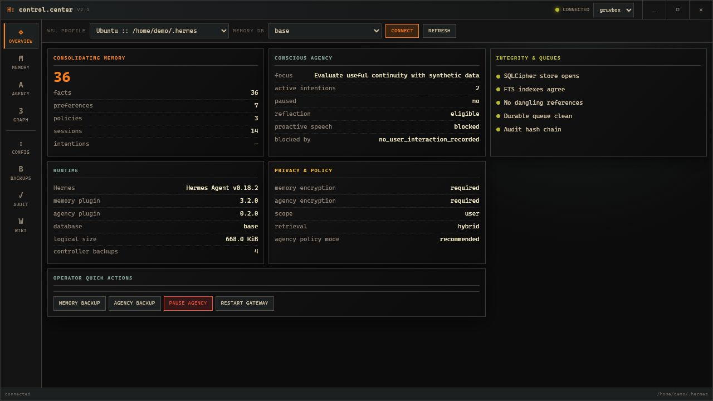
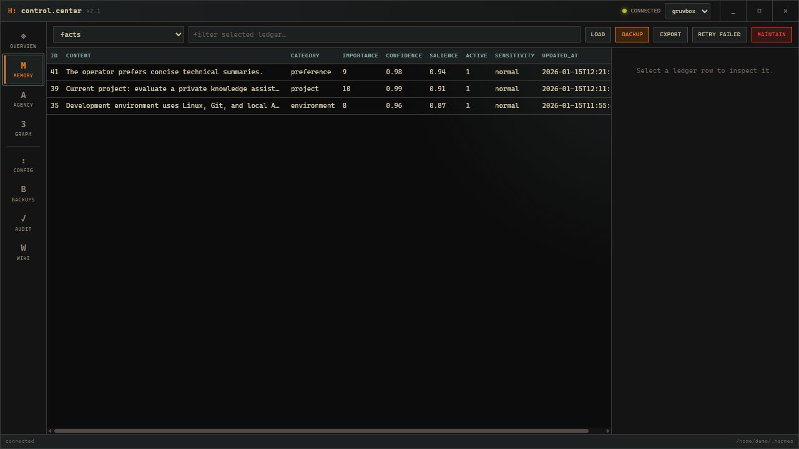
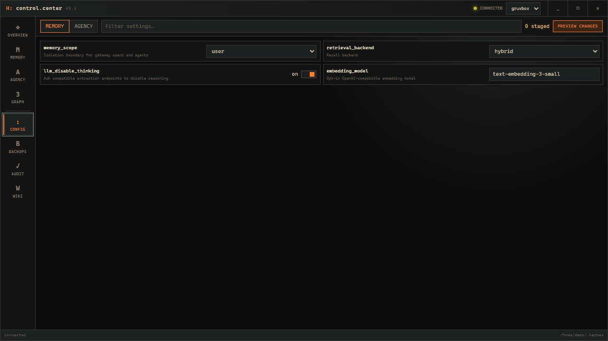
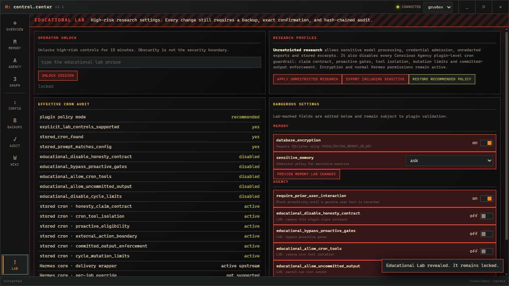
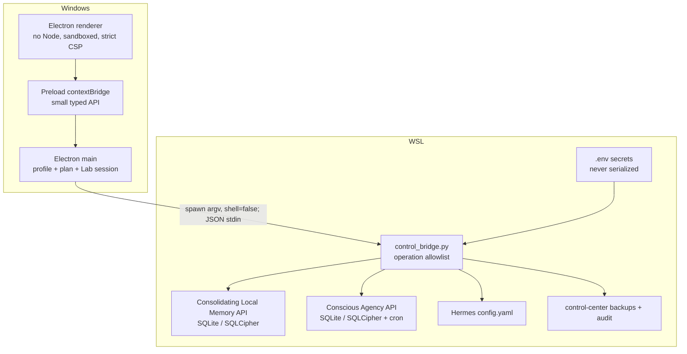
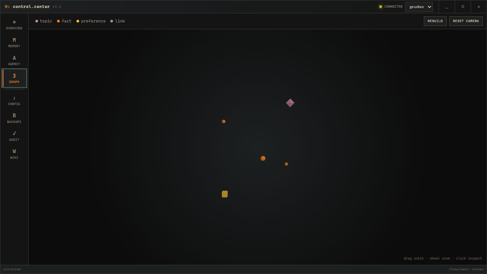

# Hermes Control Center

A compact Windows desktop control room for two Hermes Agent plugins:

- [Hermes Consolidating Local Memory](https://github.com/b7216309-jpg/hermes-consolidating-local-memory)
- [Hermes Conscious Agency](https://github.com/b7216309-jpg/hermes-conscious-agency)

It audits encrypted state, browses every current ledger, edits supported records, controls agency
state and cron, manages configuration, creates verified backups, restores databases, visualizes the
memory graph, and records every mutation in a hash-chained operator log.

Version 2 is an in-place security rewrite of the original Hermes Memory Control app. It keeps the
compact terminal/Gruvbox visual language while removing the privileged renderer, raw SQL bridge,
shell command construction, static temporary files, and old-schema assumptions.

Version 2.3.1 supports Conscious Agency 0.5's state-first cold and continuity conditions. It shows
factual state metrics, understands protocol 1.4's source-separated continuity chains, and keeps a
legacy display fallback for older Agency snapshots. The encrypted longitudinal journal remains
browsable without creating a second runtime or delivery path.



> **Screenshot privacy:** every screenshot is captured from the built-in synthetic demo API. It
> contains no live Hermes profile, memory, filesystem path, identifier, endpoint, or secret. Never
> capture documentation images from a connected Hermes installation.

## What it controls

| Workspace | Audit surfaces | Operator controls |
|---|---|---|
| Overview | Hermes/plugin versions, SQLCipher health, FTS consistency, dangling references, queues, scope, policy and proactive gates | Memory/agency backup, agency pause, gateway restart |
| Memory | Facts, topics, episodes, sessions, traces, journals, summaries, preferences, policies, contradictions, history, links, evidence, working memory, procedures, prospective memory, autobiographical events, associations, approvals and pending operations | Schema-aware edits, fact deactivation/reactivation, approvals, prospective-memory resolution, retry failed work, maintenance, redacted export, backup and restore |
| Agency | Subjective journal, persistent workspace, self-model, intentions, reflections, decisions, events, runtime, factual state metrics and all proactive gates | Subjectivity condition, focus, intentions, questions, self-observations, pause/resume, cron install/update/run/pause/resume/remove, backup and restore |
| Config | The memory plugin's advanced schema and the agency config dataclass, loaded from the installed plugins | Staged diffs, plugin validation, atomic save, config backup and restart guidance |
| Graph | Topics, facts, preferences, membership, links and contradictions | Interactive Three.js orbit, zoom, hover and inspect |
| Wiki | The compiled local memory wiki | Sanitized in-app Markdown reading |
| Backups | Controller-owned memory and agency backups | New backup and verified restore |
| Audit | Append-only operation records and chain integrity | Local verification |



## Requirements

- Windows 10 or 11 with WSL2.
- Hermes Agent installed inside WSL at `~/.hermes`.
- The current memory and agency plugins installed and enabled.
- Node.js 22 or newer and npm on Windows.
- SQLCipher installed in Hermes' Python environment when either plugin has database encryption
  enabled.

The real integration suite currently covers:

- Hermes Agent `0.18.2`;
- Consolidating Local Memory `3.3.1`;
- Conscious Agency `0.5.0`;
- encrypted base and user-scoped databases;
- Electron `43`.

The controller queries plugin-owned schemas at runtime. If a future plugin version is incompatible,
an operation fails closed and reports the mismatch instead of guessing or issuing raw SQL.

## Install

Run these commands in Windows PowerShell, not inside WSL:

```powershell
git clone https://github.com/b7216309-jpg/hermes-memory-control.git
cd hermes-memory-control
npm ci
npm start
```

`npm ci` installs the pinned dependency tree. `npm start` builds the renderer locally and opens the
Electron app. No server is exposed on the network.

### First connection

1. Open **Overview**.
2. Select the detected WSL distribution and Hermes home.
3. Select `base` or one of the discovered hashed scope databases.
4. Press **Connect**.

Connecting is read-only. It does not rewrite Hermes configuration, restart the gateway, or modify
plugin policy. The controller reads `.env` only inside WSL so SQLCipher can open the stores; secret
values are never returned to Electron.

When `memory_scope` is `user` or `agent`, each hashed database is shown as a separate selectable
scope. The UI sends only its opaque ID back to the bridge—never an arbitrary filesystem path.

## Daily use

### Audit memory

Choose a ledger in **Memory**, optionally filter it, and click a row. Fields supported by the
installed schema become editable controls. Structural identifiers, fingerprints, queue payloads,
evidence topology and immutable history remain read-only.

Saving an edit:

1. creates an encrypted-compatible database backup;
2. validates the table, row ID, field names, types and ranges;
3. recomputes normalized content, fingerprint and signature for edited facts;
4. validates temporal kind, finite timestamps, interval order, precision, confidence, and IANA timezone;
5. synchronizes canonical temporal metadata and linked autobiographical timeline state;
6. applies one transaction;
7. appends the change to the memory plugin's own history;
8. appends the completed operation to the controller audit chain.

Use **Deactivate** for a reversible fact lifecycle change. Hard deletion is intentionally absent
from the normal interface.

### Control agency

The **Agency** workspace exposes the current focus, unresolved questions, factual state metrics and
exact proactive blockers. It can:

- set or clear focus;
- create and complete/block/cancel intentions, and set or clear their ISO-8601 deadlines;
- add and resolve questions;
- append explicit self-observations;
- pause or operator-resume agency behavior;
- install/update, run, pause, resume or remove the agency cron using its currently configured
  safe or Educational Lab policy.
- inspect the exact final-output journal by model, source, condition, protocol version, continuity
  link and SHA-256 digest.

Reflections, decisions, subjective entries and operational events are inspectable immutable
ledgers. Subjective rows contain final visible model messages, not hidden reasoning. They are kept
separate from personal memory and ordinary agency reflections so longitudinal data remains
queryable without changing memory retrieval.

### Change configuration

Configuration fields come from the installed plugins rather than a frozen copy in the app. Changes
are staged visibly and then sent through the same preview/confirmation flow as database mutations.
The complete Hermes config is backed up and replaced atomically only after validation.

Restart the gateway from **Overview** when the result says `restart_required`.

Encryption switches are displayed but read-only. Turning SQLCipher off in YAML does not decrypt a
database; it only makes the store unreadable. Encryption changes therefore require a deliberate
migration outside the normal config editor.



### Backup, restore and export

Controller files live under:

```text
~/.hermes/control-center/
├── audit.jsonl
├── backups/
│   ├── memory/
│   └── agency/
├── config-backups/
└── exports/
```

Directories are restricted to mode `0700` and files to `0600` where the platform supports Unix
permissions. Database backups use each plugin's active SQLite/SQLCipher driver and pass
`PRAGMA integrity_check` before replacement.

Restore accepts only a controller backup ID. It never accepts a renderer-supplied path. The bridge
checks whether the gateway is running, stops it only when necessary, restores through a temporary
database, replaces sidecars safely, and restores the previous gateway run state.

Normal exports redact sensitive memory. Unredacted export is available only in Educational Lab.

## Mutation safety contract

Every state-changing action follows the same path:

```mermaid
flowchart LR
    UI["Isolated renderer"] -->|allowlisted intent| MAIN["Electron main"]
    MAIN --> PLAN["Single-use 2-minute preview"]
    PLAN -->|exact phrase| BRIDGE["WSL Python bridge"]
    BRIDGE --> VALIDATE["Plugin schema + bounded payload validation"]
    VALIDATE --> BACKUP["Verified automatic backup"]
    BACKUP --> TX["Plugin API or one bounded transaction"]
    TX --> HISTORY["Plugin history"]
    HISTORY --> AUDIT["Hash-chained controller audit"]
```



The UI cannot request arbitrary SQL, shell commands, environment variables or file paths. The
bridge protocol consists of explicit operation names and bounded JSON payloads.

Audit entries keep operation metadata and SHA-256 proofs for sensitive text fields; they do not
duplicate memory content, prompts, observations or messages. Failed mutation attempts are logged
when the audit directory remains available.

## Educational Lab



The Lab keeps high-risk research controls out of normal operation without pretending that a hidden
menu is a security boundary.

Reveal it with either:

- `Ctrl+Shift+L`; or
- seven clicks on `v2.3` in the title bar.

Then type:

```text
I UNDERSTAND THIS IS AN EDUCATIONAL LAB
```

The main process unlocks Lab operations for 15 minutes. Reloading the UI does not bypass this
check. Lab changes still require a preview, exact operation phrase, backup and audit record.

The **Unrestricted research** profile atomically changes both plugin sections to:

- admit sensitive and credential memory;
- allow sensitive text to reach configured model endpoints;
- permit unredacted memory exports;
- store bounded agency transcript excerpts;
- remove prior-interaction, cooldown and silence timing gates;
- raise the daily proactive-message budget;
- remove the Conscious Agency honesty/claim contract;
- bypass the plugin's proactive eligibility gates;
- remove cron tool isolation and the conversation-only boundary;
- remove per-cycle reflection and state-change limits;
- allow the cron model's uncommitted final output to pass through.
- enable the minimal state-first `continuity` condition across normal conversations and cron,
  including only a short earlier trace from the same model and source;
- capture every final model message in the encrypted subjective journal.

Database encryption stays on. Hermes/provider/platform/OS permissions and operator pause remain
authoritative. **Restore recommended policy** atomically returns every privacy, timing, prompt,
tool, mutation and output setting to conservative defaults and sets the subjective experiment to
`off`. Existing journal rows are preserved for audit until the operator deliberately restores or
replaces the encrypted Agency database. Individual Lab-marked settings can also be staged.

The profile is one rollback-protected operation: validate both plugin sections, back up
`config.yaml`, atomically replace it, refresh the already-installed Hermes cron job, restart the
gateway if it was running, and then audit the result. If cron refresh or activation fails, the
controller restores the prior config and prompt. It never silently creates a missing cron job.

The effective-policy audit reads the recorded agency job ID, hashes the prompt actually stored in
`~/.hermes/cron/jobs.json`, compares it with the prompt generated from current plugin configuration,
and reports every remaining plugin-level cron guardrail. Prompt text itself is never copied into the
controller audit log.

Hermes 0.18.2 also prepends a scheduler-wide delivery wrapper to every cron prompt. It explains
automatic delivery, tells the model not to duplicate delivery with `send_message`, and defines
`[SILENT]`. This is not stored in the job and has no supported per-job disable switch in that Hermes
release. Control Center reports it separately as **Hermes core · delivery wrapper** and never
mislabels plugin-level unrestricted mode as removal of upstream Hermes behavior.

## Architecture and trust boundary



Electron is configured with:

- `contextIsolation: true`;
- `nodeIntegration: false`;
- `sandbox: true`;
- `webSecurity: true`;
- denied navigation and new windows;
- a local-only Content Security Policy.

See [SECURITY.md](SECURITY.md) for the full threat model and limits.

## Memory graph



Topics are violet octahedrons, facts are orange particles and preferences are amber cubes. Link
and contradiction edges are generated only between known nodes. The renderer receives bounded
graph data, not a SQL surface.

## Themes

The title bar includes Gruvbox, Nord and Forest palettes. The theme preference is the only value
stored in browser local storage. Hermes paths, config, memory content, confirmation plans and
secrets are not stored there.

## Verification

```powershell
npm test                 # renderer build + Node contract/security tests
npm run test:bridge      # Python bridge, audit, restore and transaction tests
npm run test:wsl         # real installed plugins and encrypted stores in WSL
npm run test:electron    # real isolated Electron renderer startup
npm audit
```

The optional safe mutation smoke creates one memory backup and one agency backup, then verifies the
audit chain:

```powershell
$env:HMC_MUTATION_SMOKE = '1'
npm run test:wsl
Remove-Item Env:HMC_MUTATION_SMOKE
```

CI runs Node and Python tests on both Windows and Linux. The WSL and Electron smoke suites remain
local because hosted Linux runners do not provide the user's Hermes installation or a Windows
desktop session.

## Troubleshooting

### No WSL profile found

Start the distribution once and confirm Hermes exists:

```powershell
wsl -l -v
wsl -d Ubuntu -- test -f ~/.hermes/config.yaml
```

The current app discovers the default Linux user's `~/.hermes`. A custom Hermes home is not
accepted through a free-text renderer path; add an explicit trusted profile in code instead.

### Gateway stops when the last WSL terminal closes

Some WSL installations shut down the Ubuntu VM when the final Windows `wsl.exe` client exits;
systemd enablement and linger keep the service eligible to run but do not keep that VM alive. If
`journalctl --user -u hermes-gateway.service` shows a clean `SIGTERM` at the same time, create one
hidden per-user keepalive task from Windows PowerShell:

```powershell
$name = 'Hermes WSL Gateway Keepalive'
$action = New-ScheduledTaskAction `
  -Execute "$env:WINDIR\System32\wsl.exe" `
  -Argument '-d Ubuntu --exec /bin/bash -lc "systemctl --user start hermes-gateway.service && exec /bin/sleep infinity"'
$trigger = New-ScheduledTaskTrigger -AtLogOn -User $env:USERNAME
$settings = New-ScheduledTaskSettingsSet -ExecutionTimeLimit ([TimeSpan]::Zero) `
  -RestartCount 3 -RestartInterval (New-TimeSpan -Minutes 1) `
  -MultipleInstances IgnoreNew -AllowStartIfOnBatteries -DontStopIfGoingOnBatteries
$principal = New-ScheduledTaskPrincipal -UserId "$env:USERDOMAIN\$env:USERNAME" `
  -LogonType Interactive -RunLevel Limited
Register-ScheduledTask -TaskName $name -Action $action -Trigger $trigger `
  -Settings $settings -Principal $principal -Force
Start-ScheduledTask -TaskName $name
```

This keeps WSL and Hermes active only while that Windows user is logged in. It also keeps the WSL
VM's memory allocated. Remove it with
`Stop-ScheduledTask -TaskName $name; Unregister-ScheduledTask -TaskName $name -Confirm:$false` if
your WSL build already stays alive or you no longer need background Telegram/cron service.

### SQLCipher key is missing

The bridge loads `~/.hermes/.env` inside WSL without printing it. Confirm the variable named by the
plugin config exists in that file and that `sqlcipher3` is installed in Hermes' virtual environment.
Never paste the key into the controller.

### A table is reported incompatible

Update the controller and plugins together, run the plugin's own doctor command, then rerun:

```powershell
npm ci
npm run test:wsl
```

An incompatible table stays inaccessible rather than falling back to raw SQLite behavior.

### Agency policy shows `stale_cron_prompt`

The cron job contains an older prompt snapshot than the installed plugin would generate. Use
**Agency → install/update cron**, or reapply the desired Lab/recommended profile. Version 2.2
refreshes the prompt automatically whenever agency configuration is changed through the controller.
Control Center 2.3.1 additionally displays Conscious Agency 0.5's factual state metrics and audits
the configured subjectivity condition and refreshed prompt hash.

### Agency policy shows `unsupported_plugin_version`

Install Conscious Agency 0.5 or newer. Older source-patched builds do not expose the current,
auditable Educational Lab controls required for safe/reversible profile changes.
The state-first protocol 1.4 context and source-separated continuity require Conscious Agency 0.5
or newer. Control Center retains a read-only display fallback for legacy `control_signals`
snapshots during upgrades.

## License

MIT. See [LICENSE](LICENSE).
